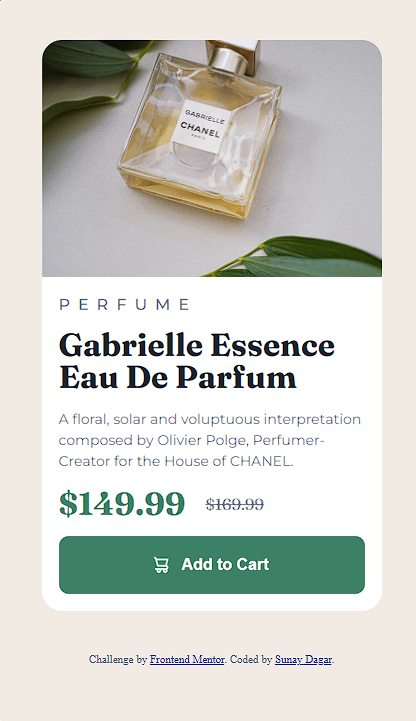
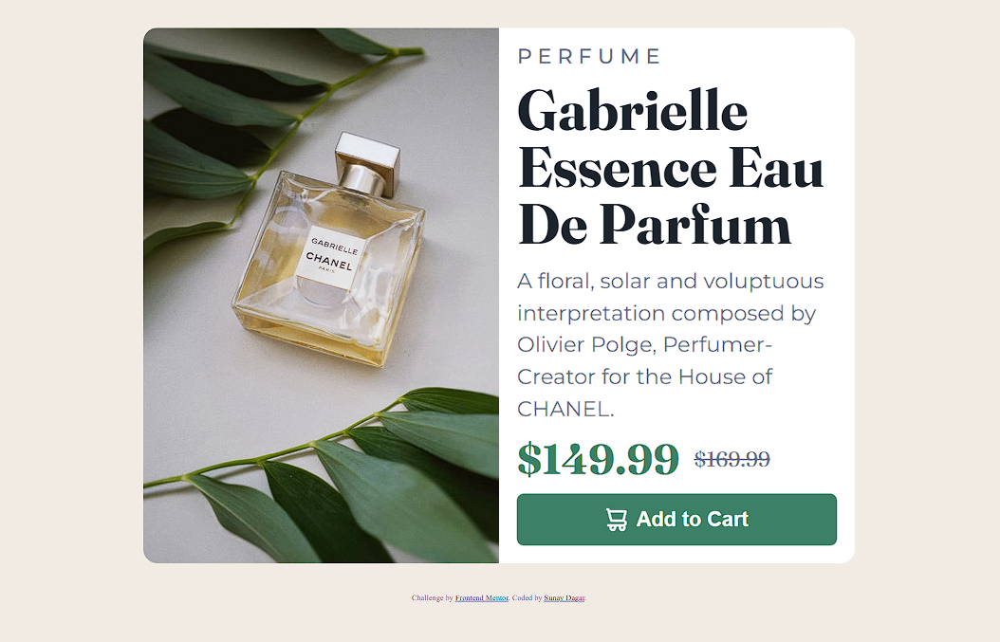

## Table of contents

- [Overview](#overview)
  - [Screenshot](#screenshot)
  - [Links](#links)
- [My process](#my-process)
  - [Built with](#built-with)
  - [What I learned](#what-i-learned)
  - [Useful resources](#useful-resources)
- [Author](#author)
- [Questions](#Questions)

## Overview

### Screenshot📸

- A screenshot of my final solution.

## My process

### Built with🏗️

- Semantic HTML5 markup
- SASS/SCSS
- CSS Flexbox
- CSS Grid

### What I learned📝

- First time using SASS/SCSS after learning from an online [tutorial](https://www.youtube.com/watch?v=_a5j7KoflTs&t=398s). I learnt how to implement the SASS file structure, variables, nesting, functions, mixins as well as the `clamp()` function to make responsive font sizes.
- Researching online helped me solve alot of responsiveness issues i was facing, all hail stack overflow 💯.
  -Further improved my understanding of my base CSS knowledge especially CSS Grid & Flexbox.

### Useful resources

- [MDN Web Docs](https://developer.mozilla.org/en-US/) - An excellent resource to make quick referrals, and the demo code provided helps me to better understand the code I write.

## Author📖

- Website - [Sunay Dagar](https://suzzy-dszy.github.io/Social-Links-Profile/)
- Frontend Mentor - [@suzzy-dszy](https://www.frontendmentor.io/profile/suzzy-dszy)

## Questions❔

Since is my first hands on project with SASS/SCSS, any feedback/ tips on how i can perhaps write my code better or if you have spotted any issues will be much appreciated 🙏.
